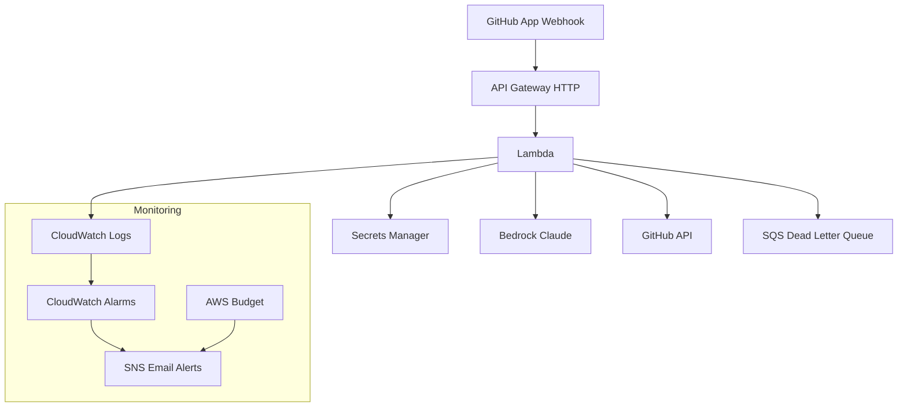
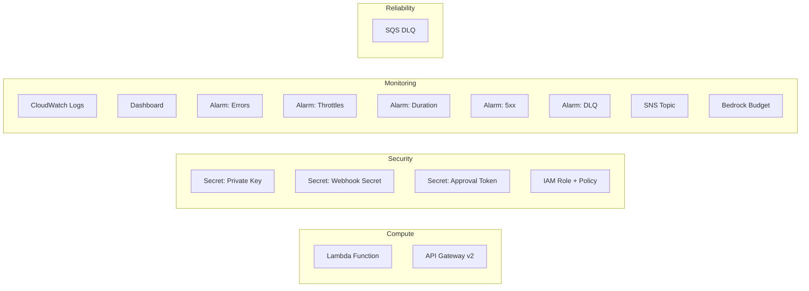

# terraform-aws-pr-auto-approver

Terraform module that deploys a GitHub App PR auto-approver to AWS with AI code review via Amazon Bedrock.

## Architecture



## Resources Created



## Usage

### Basic

```hcl
module "approver" {
  source  = "jonmatum/pr-auto-approver/aws"
  version = "~> 1.6"

  github_app_id          = "123456"
  github_app_private_key = file("private-key.pem")
  github_webhook_secret  = var.webhook_secret
  allowed_authors        = "your-username"
  lambda_zip_path        = "./lambda.zip"
}
```

### Full (Bedrock + PAT + Monitoring)

```hcl
module "approver" {
  source  = "jonmatum/pr-auto-approver/aws"
  version = "~> 1.4"

  github_app_id          = "123456"
  github_app_private_key = file("private-key.pem")
  github_webhook_secret  = var.webhook_secret
  allowed_authors        = "your-username"
  lambda_zip_path        = "./lambda.zip"

  bedrock_enabled    = true
  approval_token     = var.approval_token
  monitoring_enabled = true
  alert_email        = "you@example.com"
}
```

## Approval Modes

| Mode | How | Branch Protection |
|------|-----|-------------------|
| **App token** (default) | Bot approves as GitHub App | ❌ Doesn't count on Free plan |
| **PAT token** (recommended) | Bot approves as real user | ✅ Counts toward required reviews |

## Security

- All secrets in AWS Secrets Manager — never in Lambda env vars
- IAM scoped to specific secrets only
- API Gateway throttling (burst: 10, rate: 5 req/s)
- Webhook signature verified on every request
- SQS DLQ for failed webhook processing

## Inputs

| Name | Description | Type | Default | Required |
|------|-------------|------|---------|----------|
| name | Resource name prefix | `string` | `"pr-auto-approver"` | no |
| github_app_id | GitHub App ID | `string` | | yes |
| github_app_private_key | Private key (PEM) | `string` | | yes |
| github_webhook_secret | Webhook secret | `string` | | yes |
| allowed_authors | Comma-separated usernames | `string` | `""` | no |
| lambda_zip_path | Path to Lambda zip | `string` | | yes |
| approval_token | GitHub PAT for approvals | `string` | `""` | no |
| bedrock_enabled | Enable AI review | `bool` | `false` | no |
| bedrock_model_id | Bedrock model | `string` | Claude 3.5 Haiku | no |
| monitoring_enabled | Enable dashboard/alarms | `bool` | `false` | no |
| alert_email | Email for alerts | `string` | `""` | no |
| bedrock_monthly_budget | Monthly budget (USD) | `number` | `50` | no |
| tags | Resource tags | `map(string)` | `{}` | no |

## Outputs

| Name | Description |
|------|-------------|
| webhook_url | GitHub App webhook URL |
| lambda_function_name | Lambda function name |
| lambda_function_arn | Lambda function ARN |
| api_gateway_id | API Gateway ID |
| api_gateway_endpoint | API Gateway base URL |
| sns_topic_arn | SNS topic ARN |
| dashboard_url | CloudWatch dashboard URL |
| dlq_arn | Dead letter queue ARN |

## License

MIT
